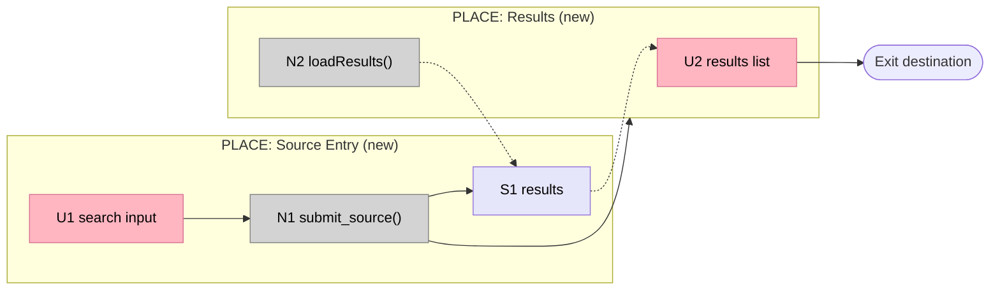

# Breadboarding

Breadboarding is a lightweight technique for visualizing and verifying a flow at the wiring level - before any visual design or implementation begins. It surfaces every place, every affordance, and the flows between them, in two views: the **current version** (how the system works today, with the framed problem located on it) and the **alternate version** (the proposed change). The output is a wiring diagram that shows what exists, where it lives, and what it connects to.

Use it whenever a concept needs to be made concrete enough to reason about - during shaping, during a design review, or at the start of a build cycle.

## Two versions, one canvas

Breadboarding tells the shape's whole argument in two drawings on the same canvas:

- **Current version** — how the existing system actually takes the user through the flow today, with the **framed problem located on it** (⚠️ at the exact place/affordance/flow where the pain lives). This is where the issues the frame addresses get pinned to reality.
- **Alternate version(s)** — the shape: the same flow with places, affordances, and flows *adjusted* so every ⚠️ becomes ✅. The alternate resolving all of the current's ⚠️, within appetite, **is** how the shape gets verified against the frame.

Capturing the current version faithfully is the foundation. A wrong current picture makes every alternate a guess.

**Entry modes:**
- **Capture-current (from `shape-up:shape` Phase 3, or a standalone review):** run Step 0 only — the current-version breadboard with the problem overlay. This becomes the CURRENT baseline the shapes are drawn against.
- **Draw-alternate (from `shape-up:shape` Phase 5):** the current version and the chosen shape already exist in the session — do NOT rebuild requirements/shapes/fit check. Draw the alternate as edits to the current (Step 4 onward) and verify ⚠️→✅.
- **Standalone full:** Step 0, then all steps.

**Three iron rules — these are the ones that break in real use:**

```
1. CODE-ANSWERABLE-FIRST. Before asking the user anything about a path, a
   condition, a status, or what-calls-what — answer it from the code. Reading
   the code is your job (division of labor: codebase truth is yours). Only
   genuinely code-absent facts go to the user: domain intent, why a rule
   exists, whether a rule is complete, external-service behavior, present/
   absent invariants the code does not encode.

2. TRACE EVERY REPO THE FLOW TOUCHES. In a microservice system the flow crosses
   services. Enumerate every service it touches; confirm you have each repo. A
   cross-service call is read in the callee's repo — never assumed. Missing a
   repo → pause and ask for the git URL (frame's pause-for-research), never
   guess what the other service does.

3. DRAFT, THEN CORRECT — never present a finished picture. You draft the flow
   from code; the domain expert corrects it with knowledge the code cannot
   hold. Iterate. (This is DDD knowledge-crunching — see references/current-flow.md.)
```

**The dialogue law carries over: you draft the wiring; the user makes the calls.** A wiring choice that embeds a trade-off — where a flow starts, what stays manual vs. automated, which place owns an affordance — is a design decision, not notation. Return each as a decision point.

**The breadboard is for humans. The tables are for the AI. Both are required outputs.**

## Vocabulary

**Affordance prefixes:**
- `P#` - Place: a bounded context of interaction (P1, P2...)
- `U#` - UI affordance: a button, field, link, or display the user sees or acts on (U1, U2...)
- `N#` - Code affordance: a handler, query, service, or system event the code calls (N1, N2...)
- `S#` - Data store: state that is written and read (S1, S2...)
- `~` prefix - optional: may be descoped if appetite requires

**Place types:**
- `PLACE` - a screen or view the user navigates to
- `TRIGGER` - an event-driven entry point, not user-navigated
- `DATA STORES` - persistent storage
- `COMPONENT` - a reusable UI component with internal logic

**The Blocking Test - primary test for whether something is a new PLACE:**
```
Can the user interact with what's behind this element?
  NO  → it is a different PLACE (modal, edit mode, blocking overlay)
  YES → it is local state in the same PLACE (dropdown, tooltip, checkbox revealing fields)
```

**PLACE granularity - one route can contain multiple PLACEs:**
A PLACE is where the user perceives they have arrived, not where the URL changes. Could the user describe where they are right now in one word? If the answer is the same as the previous step, it is not a new PLACE.

**Which place type to use:**
```
Is the user navigating here intentionally?
  YES → PLACE

Is it started by a system event (webhook, background job, purchase hook)?
  YES → TRIGGER

Is it a table, record store, or persistent data structure?
  YES → DATA STORES

Is it a reusable UI element with internal logic that appears in multiple places?
  YES → COMPONENT

IF none of the above → reconsider whether it is a place or an affordance inside another place
```

**Where to put a N# affordance:**
```
Does it handle a user event from a specific place?
  YES → put it inside that PLACE subgraph

Is it spawned or called by another N# in the same place?
  YES → put it in the same subgraph as its caller

Is it a domain or service call invoked from a single place?
  YES → put it inside that place's subgraph

Is it called from multiple places?
  YES → let it float outside subgraphs, draw edges from each caller

IF unsure → place it where the user action that triggers it originates
```

**Subgraph syntax:** `subgraph id["PREFIX: Label (existing/new)"]`
The `id` is the internal reference (no spaces). The quoted string is the display label shown in the diagram - always prefixed with the place type.

```
subgraph P1["PLACE: Source Entry (new)"]
subgraph trigger["TRIGGER: POS purchase"]
subgraph stores["DATA STORES"]
subgraph sig["COMPONENT: Signature"]
```

**Wires Out vs Returns To:**

**Wires Out** = control flow: what this affordance triggers, calls, or writes to.
**Returns To** = data flow: where this affordance's output flows back to.

Solid arrows `-->` in the diagram represent Wires Out. Dashed arrows `-.->` represent Returns To.

**Navigation wiring:** when an affordance causes the user to navigate to a different Place, wire to the Place itself - not to an affordance inside it.
```
✅ N1 Wires Out: → P2       (navigate to Place 2)
❌ N1 Wires Out: → U3       (wiring to affordance inside P2)
```

## Step 0: Capture the Current Version

Run this whenever an existing system is involved (nearly always). It is a dialogue, not a dump — you draw, the domain expert corrects, you redraw. Full method and a worked draw-correct exchange: `references/current-flow.md`. Read it before your first pass.

**a. Enumerate the flow's territory.** Name every place the flow passes through and every service/repo it touches. Confirm you have each repo (iron rule 2). Missing one → ask for it, do not guess across the boundary.

**b. Trace it from the code and draft the current breadboard.** Read the code for the paths and conditions (iron rule 1 — do not ask the user what the code can tell you). Draw it at the right altitude: **the user flow and lightly what each affordance does — not full functional detail** (distillation; leave out what the domain expert would not care about). Places = where the user can go; affordances = what they can do; flows = arrows between places.

**c. Surface the guards.** Along the flow, capture the conditions that gate whether a step or the whole flow exists:
- a **status** that must be reached (`:inbox`, `:published`, `paid`)
- a **right/permission** the user must hold
- something that must be **present or absent** (a linked record, a non-null field, a feature flag, a not-frozen space)

These are the business rules often *hidden as guard clauses* in the code (DDD's overbooking example: "allow 10% overbooking" buried in an `if`). Read them from the code, then surface each one for the expert to confirm, correct, or complete — the code shows the guard exists; only the expert knows if it is right and whole.

**d. Present the draft for correction.** Show the breadboard, walk one real scenario through it out loud, and ask the expert to correct it — wrong flow, missing branch, a guard that is really different in the business. Redraw. Repeat until they recognize it. Mark any edge or guard you are unsure of for their confirmation rather than asserting it.

**e. Locate the framed problem on it.** Overlay ⚠️ at the exact place / affordance / flow where the frame's pain occurs. (This ⚠️ is the *problem marker* — distinct from the ⚠️ the shape skill uses in `references/notation.md` to flag an unknown mechanism in a drafted shape. The alternate version will turn each into ✅.)

**Gate:** the domain expert recognizes the current breadboard as their system; every guard along the flow is captured and confirmed; the framed problem is pinned to its location(s). This is the CURRENT baseline.

## Step 1: Build the Requirements Table

Before drafting any alternate, enumerate what the solution must achieve. Each requirement is one testable statement. (From `shape-up:shape`, the requirements already exist — do not rebuild them.)

| ID | Requirement |
|---|---|
| R0 | [statement] |
| R1 | [statement] |

Do not draft shapes until the requirements table is complete.

## Step 2: Draft Alternate Versions

An alternate version is the current flow with places, affordances, and flows **adjusted** so the ⚠️ problems become ✅. Each alternate is a shape. Draw it as edits to the current breadboard — a moved affordance, a new place, a re-routed flow — so the expert can see exactly what changes and what stays. Draft 1–2 alternatives as numbered part lists; each part is a named component; sub-items describe the mechanism, not pixel-level detail. Include the cheapest alternate that resolves the ⚠️.

```
A: [Shape name]
A1  [Component name]
A1.1  [What it does and how]
A1.2  [Sub-detail]
~A2  [Optional component - marked for potential descoping]
```

Limit to 2 shapes before running a fit check. More than 2 before checking wastes time.

## Step 3: Fit Check

Compare each shape against every requirement. The fit check is binary:
- `✅` - requirement satisfied
- `❌` - requirement not satisfied

| ID | Requirement | CURRENT | A | B |
|---|---|---|---|---|
| R0 | [statement] | ❌ | ✅ | ✅ |

The CURRENT column is the current-version breadboard from Step 0 — its ❌s are the ⚠️ problem markers. The fit check and the ⚠️→✅ overlay are the same verification in two forms: an alternate passes only when every ⚠️ on the current version becomes a ✅ on the alternate. A requirement still ❌ in the winning column is a ⚠️ the shape did not resolve.

Select the shape where all requirements are ✅. If no shape passes, identify the failing requirements and revise that shape. Do not proceed to Step 4 with an open ❌ in the winning column.

## Step 4: Enumerate Affordances

For the winning shape, build four tables. Every affordance that appears in the wiring diagram must have a row here.

**Places Table**

| # | Place | Description |
|---|-------|-------------|
| P1 | [place name] | [what the user can do here] |

**UI Affordances**

| # | Place | Component | Affordance | Control | Wires Out | Returns To |
|---|-------|-----------|------------|---------|-----------|------------|
| U1 | P1 | [component] | [affordance name] | [click/type/render] | [N# or P#] | [N# or U#] |

**Code Affordances**

| # | Place | Component | Affordance | Control | Wires Out | Returns To |
|---|-------|-----------|------------|---------|-----------|------------|
| N1 | P1 | [component] | [function()] | [call/observe/write] | [N# or P#] | [U# or N#] |

**Data Stores**

| # | Place | Store | Description |
|---|-------|-------|-------------|
| S1 | P1 | [store name] | [what it holds] |

**Column definitions:**
- **Control**: the triggering event - `click`, `type`, `call`, `observe`, `write`, `render`
- **Wires Out**: control flow - what this triggers or calls. Navigation wires to Places: `→ P2`
- **Returns To**: data flow - where output goes. Return values, store reads.

**Before moving to Step 5, confirm** the four tables are internally sound. This is mechanical — run the validator rather than eyeballing it:

```
scripts/check-tables.sh docs/concepts/[name]/shape.md
```

It reports, and exits non-zero on any ERROR:
- a `Wires Out`/`Returns To` reference to a row (P#/U#/N#/S#) that isn't defined — dangling reference (ERROR)
- an `N#` with neither Wires Out nor Returns To — dead code affordance (ERROR)
- an `S#` no affordance reads or writes — orphan store (ERROR)
- a `Wires Out` targeting a `U#` — navigation should target its Place, `P#` (WARN)
- an isolated `U#`, or a `P#` that owns no affordance (WARN)

Fix every ERROR before Step 5; judge each WARN (some are legitimate). The script checks wiring only — that every `U#` which *displays data* actually has a data source, that optional affordances are marked `~`, and that the flow is right, remain your read.

## Step 5: Generate the Wiring Diagram

Generate a Mermaid flowchart from the affordance tables. Group affordances by place. Show flows as directed arrows between affordance nodes.

**Reading direction:** Use `flowchart LR` (left-to-right). The diagram starts at the upper left and follows arrows toward the right edge - entry point declared first, exit last. This matches the natural reading direction of a flow.

**Compact subgraphs:** Add `direction TB` as the first line inside every subgraph. The overall flow reads left-to-right across places, but nodes inside each place stack top-to-bottom. Each subgraph becomes a tall narrow column - denser and more readable on smaller screens.

```
subgraph P1["PLACE: Source Entry (new)"]
  direction TB
  U1["U1 description input"]
  N1["N1 submit_source()"]
end
```

**Subgraph IDs match Place IDs:** `subgraph P1["PLACE: Name (new)"]`. This allows navigation wires like `N1 --> P2` to connect to the Place boundary.

**Enforcing reading order:**
- Declare subgraphs in intended reading sequence - entry point first, exit last. Mermaid renders them left-to-right in declaration order.
- For subgraphs with no direct flow between them (both connect to a shared hub like DATA STORES), use invisible edges to enforce horizontal sequence:

```
P1 ~~~ P2
P2 ~~~ P3
```

- Declare all visible edges after all subgraphs, in flow order from entry to exit.

**Visual conventions:**
- UI affordances (`U#`) - light pink fill: visually distinct as user-facing elements
- Code affordances (`N#`) - grey fill: visually distinct as code-level elements
- Data stores (`S#`) - lavender fill: visually distinct as persistent state
- Chunks - light blue fill: collapsed subsystems
- Optional affordances (`~`) - dashed border
- S# nodes go inside the subgraph of the Place that reads them (not a separate DATA STORES subgraph unless shared)
- Places mix UI and code: PLACE, TRIGGER, and COMPONENT subgraphs contain U#, N#, and S# nodes freely
- Terminal exit nodes - stadium notation `End(["Destination"])`
- Conditional flows - labeled arrows `-->|condition|`
- Subgraph label always prefixed with the place type: `PLACE:`, `TRIGGER:`, `DATA STORES`, `COMPONENT:`
- Affordances shared across multiple places can float outside subgraphs



Assign `class` at the bottom - one line per type group. Mark optional affordances with `class ~N10 opt`.

**After generating, play it through:**

Name a representative user journey. Trace it step by step through the diagram. Check for:
- Missing affordances: the user needs something that has no node
- Dead ends: a flow that reaches a place with no exit
- Data loss: information collected in one place that never arrives where it is needed
- Uncovered branches: a conditional the diagram does not show
- **Every ⚠️ resolved:** each problem marker on the current version has a ✅ counterpart in this alternate. An unresolved ⚠️ means the shape does not solve the frame — fix the alternate, not the drawing.

If the play-through finds a gap, fix the tables first, then regenerate the diagram. Do not annotate the diagram to patch a table error.

## Chunking

When a subsystem has one entry point, one exit, and many internals, collapse it to a single node in the main diagram:
- In the diagram: `chunkName[["CHUNK: name"]]` (stadium notation, light blue `chunk` class)
- Wire to/from the chunk using boundary signals
- Create a separate sub-diagram showing the internals when detail is needed

Use chunking when the subsystem would otherwise make the main diagram unreadable.

## Slicing

After the breadboard is complete, group affordances into vertical implementation slices (SL1–SL9, max 9). The `SL#` prefix is deliberate: `S#` already means data stores in this notation and scopes in `slices.md` — three meanings on one prefix is how cross-references rot.

Each slice must:
- Have demo-able UI (a slice with no visible output is a horizontal layer, not a slice)
- Demonstrate a mechanism working toward the R
- Include a one-sentence demo statement: "Type a query, results filter live"

Assign each affordance to the slice where it is first needed. Add a Slices section to `shape.md` showing the grouping:

```markdown
## Slices

| Slice | Affordances | Demo statement |
|-------|-------------|----------------|
| SL1   | U1, N1, S1  | [one sentence] |
| SL2   | U2, N2      | [one sentence] |
```

This grouping is the input kickoff uses to map scopes. The `slices.md` document is written by the kickoff skill; individual `S#-plan.md` files are written by the scope skill.

## Red Flags

| If you see this | Do this |
|---|---|
| About to ask the user a path/status/what-calls-what question | Answer it from the code first (iron rule 1). Only domain intent goes to the user. |
| The flow calls another service and I'll assume what it does | Trace the callee's repo. Don't have it? Ask for the URL — never guess across a service boundary (iron rule 2). |
| Presenting the current breadboard as finished/authoritative | Present it as a draft to be corrected. You drew from code; the expert holds what code can't. |
| Drawing the current flow with full functional detail | Wrong altitude. User flow + light affordance semantics + guards only. Distill. |
| A guard (status/right/present-absent) left off the current flow | Surface every one — they're the hidden business rules. Read from code, confirm with the expert. |
| An alternate drawn without checking every ⚠️ becomes ✅ | Unresolved ⚠️ = the shape doesn't solve the frame. Verify the overlay. |
| Rebuilding the R-table or shapes when invoked from `shape-up:shape` Phase 5 | Steps 1–3 already happened in the session. Start at Step 4. |
| A wiring trade-off resolved silently in the tables | That is a design decision. Return it to the session as a decision point. |
| A shape drafted before the R-table is complete | Stop - requirements first (standalone mode) |
| Wires Out references a number with no table row | Resolve the reference before generating |
| The diagram is annotated with prose explanations | Move the explanation to the table's Description column |
| A place has no affordances | Every place must have at least one |
| The play-through finds a gap | Fix the tables, regenerate - do not patch in prose |
| More than 2 shapes before a fit check | Run the fit check now |
| A Code affordance describes visual layout | It belongs in the UI table |
| A PLACE name is a UI component name ("Modal", "Card", "Form") | Rename to where the user IS - a task, a route, or a context |
| A PLACE name encodes sequence ("Post-X", "Pre-Y", "Step 3") | Remove the prefix - the arrows already show order |
| A loading or waiting state has its own PLACE | It is an affordance inside the current PLACE, not a destination |
| Two PLACEs have the same one-word description of what the user does | They are the same PLACE - merge them |
| A Code affordance has no Wires Out and no Returns To | It is either dead code or missing wiring - investigate |
| Navigation wires to an affordance inside a Place | Wire to the Place (P#) instead |
| A UI affordance displays data with no incoming wire | Add the data source (N# or S# that feeds it) |
| A Data Store has nothing reading from it | It is either unused or its reader is missing |

## Output

The breadboard tables and Mermaid diagram are written into `docs/concepts/[name]/shape.md` under a Breadboard section. `shape.md` already carries `shaping: true` in its frontmatter.

Slicing output goes to `docs/concepts/[name]/slices.md` and `docs/concepts/[name]/S#-plan.md`. Both must begin with `shaping: true` in their frontmatter so the ripple-check hook fires on edits.

## Handoff

Return depends on which mode you were invoked in:

- **Capture-current (from shape Phase 3):** when the expert recognizes the current breadboard, its guards are confirmed, and the framed problem is overlaid as ⚠️, return to `shape-up:shape` **Phase 3**. That breadboard is the CURRENT baseline the shapes are drawn and fit-checked against.
- **Draw-alternate (from shape Phase 5) / standalone:** when the play-through finds no gaps, every ⚠️ has a ✅ in the alternate, and the wiring diagram is written, return to `shape-up:shape` **Phase 6: Find the Rabbit Holes**.

## Quick Reference

| Step | Activity | Gate |
|---|---|---|
| 0. Current version | Trace from code (all repos), draw-correct with the expert, capture guards, overlay ⚠️ | Expert recognizes it; guards confirmed; problem located |
| 1. Requirements | R-table | Complete before any alternate is drafted |
| 2. Alternates | Current flow with places/affordances/flows adjusted, 1–2 options | Each part named; drawn as edits to current |
| 3. Fit Check | Requirements × versions matrix | Winning alternate turns every ⚠️ → ✅ |
| 4. Affordances | Places + UI + Code + Data Stores tables | `scripts/check-tables.sh` passes (no ERROR); every WARN judged |
| 5. Wiring Diagram | Mermaid LR from tables, solid for Wires Out, dashed for Returns To | Play-through finds no gaps |

Every path/condition question → the code, not the user. Every service the flow touches → its repo, never assumed. Every current breadboard → a draft the expert corrects.
