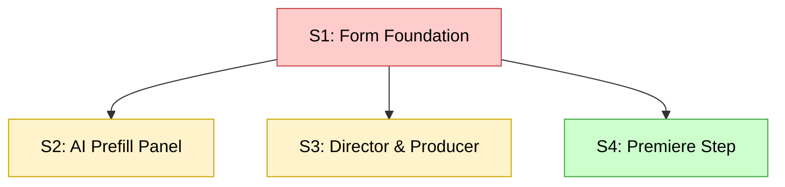
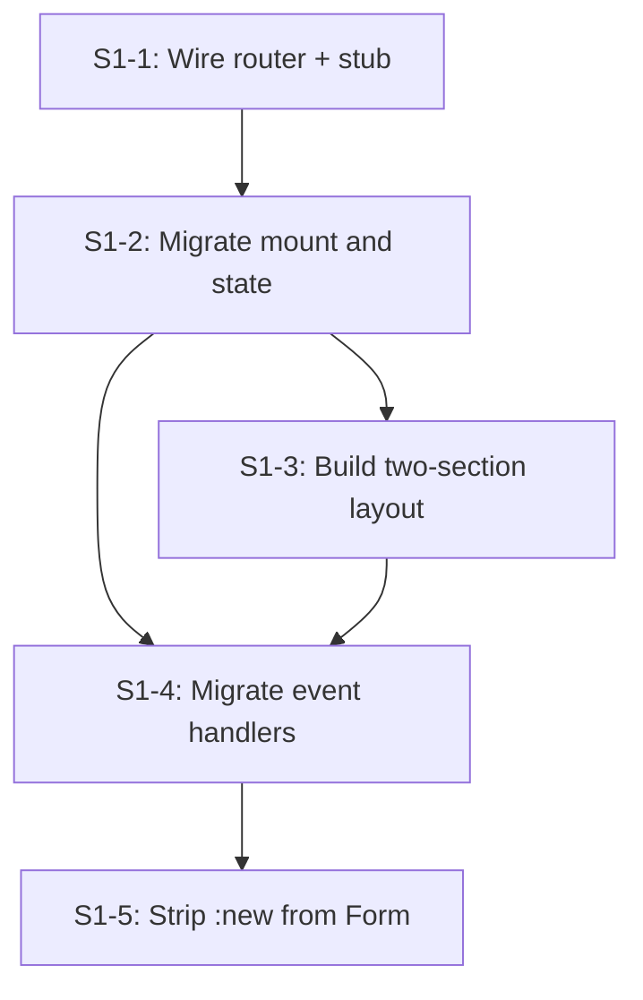

# Dependency DAG

Turns a flat list of items with "Depends on" fields into a Mermaid directed acyclic graph. The graph makes execution order, parallel opportunities, and the critical path immediately visible to any agent or person reading the plan.

**Two modes — determined by the source document:**
- **Scope mode**: reads scopes from `slices.md`; writes the diagram back under the Sequence section
- **Task mode**: reads tasks from `S#-plan.md`; writes the diagram back after the task list

## Step 1: Read the Source

For each item extract:
- **ID**: `S1`, `S2`... for scopes or `S1-1`, `S1-2`... for tasks
- **Label**: ID + short name, e.g. `S1: Form Foundation` or `S1-1: Wire router`
- **Uncertainty** (scope mode only): low / medium / high from the `**Uncertainty:**` field
- **Dependencies**: the `**Depends on:**` field value(s) — may be `none` or one or more IDs

Items with `Depends on: none` are entry points — no incoming edges.

## Step 2: Build Edges

One directed edge per dependency: `dependency --> dependent`.
"A depends on B" means draw `B --> A`.

Before rendering, check for cycles: if following any chain of edges leads back to a starting node, stop and surface it. A cycle means the dependency breakdown is wrong.

## Step 3: Render

Use `flowchart TD` (top-down). Entry points appear at the top; exit points at the bottom.

**Scope mode** — color by uncertainty:

```
classDef high fill:#ffcccc,stroke:#cc4444,color:#000
classDef medium fill:#fff3cc,stroke:#ccaa00,color:#000
classDef low fill:#ccffcc,stroke:#44aa44,color:#000
```

**Task mode** — plain nodes, no coloring.

**Scope mode example:**



**Task mode example:**



**Parallel branches** — items with a shared predecessor and no edge between them can run concurrently. No special syntax is needed: the absence of an edge between them is the signal.

## Step 4: Write Back

**Scope mode**: replace or add a `## Dependency Graph` subsection inside the Sequence section of `slices.md`.

**Task mode**: replace or add a `## Dependency Graph` section at the end of `S#-plan.md`.

If the section already exists (re-run after changes), overwrite it rather than appending a second copy.

## Red Flags

| If you see this | Do this |
|---|---|
| A cycle in the graph | STOP - the dependency breakdown is wrong; surface which items form the cycle |
| Every item chains sequentially with no parallel branches | Review "Depends on" fields - parallelism may be possible and worth capturing |
| A node has no edges at all | Verify the item truly has no dependencies and nothing depends on it |
| "Can run in parallel with" contradicts "Depends on" | Resolve the conflict in the source fields before rendering |
| The diagram is re-generated without updating the source fields first | Fix the fields, then regenerate - never patch the diagram without fixing the data |
