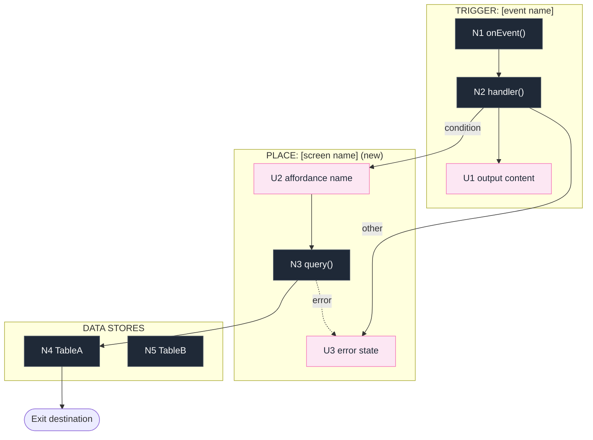

# Breadboarding

Breadboarding is a lightweight prototyping technique for visualizing and verifying a concept at the wiring level — before any visual design or implementation begins. It surfaces every UI affordance, every code affordance, and the flows between them. The output is a wiring diagram that shows what exists, where it lives, and what it connects to.

Use it whenever a concept needs to be made concrete enough to reason about — during shaping, during a design review, or at the start of a build cycle. When invoked from the shape skill, the Phase 2 elements define what must exist; breadboarding defines how those elements connect technically.

**The breadboard is for humans. The tables are for the AI. Both are required outputs.**

## Vocabulary

**Affordance prefixes:**
- `U#` — UI affordance: a button, field, link, or display the user sees or acts on
- `N#` — Non-UI affordance: a handler, query, service, data store, or system event the code calls
- `~` prefix — optional: may be descoped if appetite requires

**Place types:**
- `PLACE` — a screen or view the user navigates to
- `TRIGGER` — an event-driven entry point, not user-navigated
- `DATA STORES` — persistent storage
- `COMPONENT` — a reusable UI component with internal logic

**Wires Out:** the affordances this affordance calls or produces. Every Wires Out reference must resolve to a numbered entry in a table.

## Step 1: Build the Requirements Table

Before drafting any shape, enumerate what the solution must achieve. Each requirement is one testable statement.

| ID | Requirement |
|---|---|
| R0 | [statement] |
| R1 | [statement] |

Do not draft shapes until the requirements table is complete.

## Step 2: Draft Shapes

A shape is a proposed technical wiring of the Phase 2 elements — how they connect, what handles what, what stores what. Draft 1–2 alternative wirings as numbered part lists. Each part is a named component. Sub-items describe the mechanism, not pixel-level implementation detail.

```
A: [Shape name]
A1  [Component name]
A1.1  [What it does and how]
A1.2  [Sub-detail]
~A2  [Optional component — marked for potential descoping]
```

Limit to 2 shapes before running a fit check. More than 2 before checking wastes time.

## Step 3: Fit Check

Compare each shape against every requirement. Mark each cell:
- `✓` — requirement satisfied
- `✗` — requirement not satisfied
- `—` — not applicable

| ID | Requirement | CURRENT | A | B |
|---|---|---|---|---|
| R0 | [statement] | ✗ | ✓ | ✓ |

The CURRENT column shows what the existing system does today — used to confirm the winning shape actually improves on the status quo, not just that it satisfies the requirement in isolation.

Select the shape where all requirements are `✓`. If no shape passes, identify the failing requirements and revise that shape. Do not proceed to Step 4 with an open `✗` in the winning column.

## Step 4: Enumerate Affordances

For the winning shape, build two tables. Every affordance that appears in the wiring diagram must have a row here. Number sequentially across both tables.

**UI Affordances**

| # | Place | Affordance | Description | Wires Out |
|---|---|---|---|---|
| U1 | [Place name (existing/new)] | [affordance name] | [what the user sees or does] | [N# or U#] |

**Non-UI Affordances**

| # | Component | Affordance | Description | Wires Out |
|---|---|---|---|---|
| N1 | [Component or table name] | [function(params)] | [what it does] | [U# or N#] |

**Before moving to Step 5, confirm:**
- Every Wires Out reference resolves to a numbered row in one of the two tables
- Every place from the winning shape appears as at least one row's Place
- Optional affordances are listed and marked `~`

## Step 5: Generate the Wiring Diagram

Generate a Mermaid flowchart from the affordance tables. Group affordances by place. Show flows as directed arrows between affordance nodes.

**Visual conventions:**
- UI affordances (`U#`) — light pink fill: visually distinct as user-facing elements
- Non-UI affordances (`N#`) — dark fill: visually distinct as code-level elements
- Optional affordances (`~`) — dashed border
- Data stores — a `DATA STORES` subgraph containing regular nodes, not cylinder notation
- Places mix UI and code: PLACE, TRIGGER, and COMPONENT subgraphs contain both U# and N# nodes freely
- Terminal exit nodes — stadium notation `End(["Destination"])`
- Conditional flows — labeled arrows `-->|condition|`
- Error / failure flows — dashed arrow `-.->|error|`
- Subgraph label always prefixed with the place type: `PLACE:`, `TRIGGER:`, `DATA STORES`, `COMPONENT:`
- Affordances shared across multiple places can float outside subgraphs



Assign `class` at the bottom — one line per type group. Mark optional affordances with `class ~N10 opt`.

**After generating, play it through:**

Name a representative user journey. Trace it step by step through the diagram. Check for:
- Missing affordances: the user needs something that has no node
- Dead ends: a flow that reaches a place with no exit
- Data loss: information collected in one place that never arrives where it is needed
- Uncovered branches: a conditional the diagram does not show

If the play-through finds a gap, fix the tables first, then regenerate the diagram. Do not annotate the diagram to patch a table error.

## Red Flags

| If you see this | Do this |
|---|---|
| A shape drafted before the R-table is complete | Stop — requirements first |
| Wires Out references a number with no table row | Resolve the reference before generating |
| The diagram is annotated with prose explanations | Move the explanation to the table's Description column |
| A place has no affordances | Every place must have at least one |
| The play-through finds a gap | Fix the tables, regenerate — do not patch in prose |
| More than 2 shapes before a fit check | Run the fit check now |
| A Non-UI affordance describes visual layout | It belongs in the UI table |

## Handoff

When the play-through finds no gaps and the wiring diagram is written to the document, breadboarding is complete. Return to `shape-up:shape` and continue with Phase 4: Find the Rabbit Holes.

## Quick Reference

| Step | Activity | Gate |
|---|---|---|
| 1. Requirements | R-table | Complete before any shape is drafted |
| 2. Shapes | Numbered part lists, 1–2 options | Each part named and described |
| 3. Fit Check | Requirements × shapes matrix | Winning shape has no open ✗ |
| 4. Affordances | UI table + Non-UI table | All Wires Out resolve; all places covered |
| 5. Wiring Diagram | Mermaid from tables | Play-through finds no gaps |
